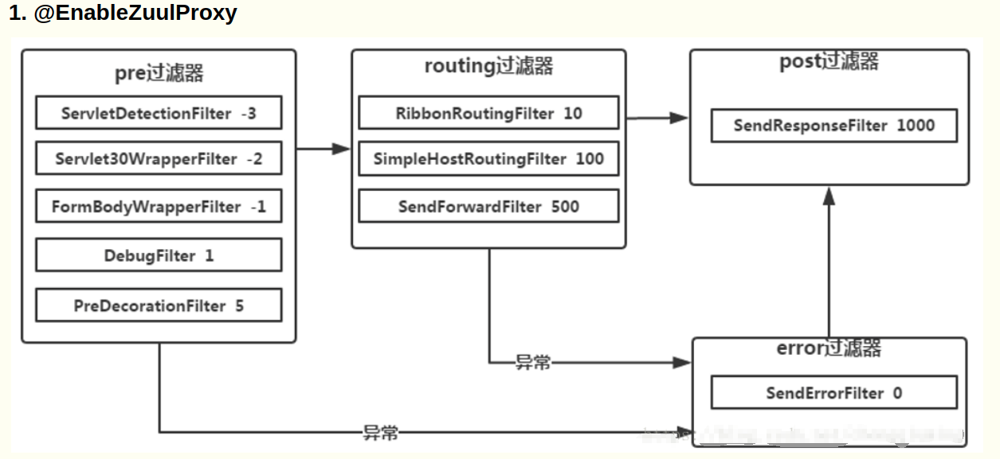
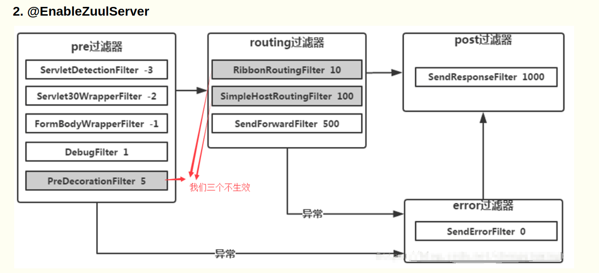

### zuul的route配置
[参考文章](https://blog.csdn.net/u012702547/article/details/78399406/)

route中path的通配符
- `?`   匹配任意单个字符

- `*`   匹配任意数量的字符，只能一个层级

- `**`  匹配任意数量的字符，可匹配多个层级

当某个路径匹配到多个route时，会按照第一个来匹配

### zuul的filter的生命周期
- pre

- route

- post

- error

### zuul的隔离机制
Zuul 使用 Hystrix 对每一个 Route 都做了隔离和限流

- 基于线程的隔离机制

- 基于信号量的隔离机制

### Ribbon重试
com.netflix.client.RequestSpecificRetryHandler
com.netflix.client.config.CommonClientConfigKey

- okToRetryOnConnectErrors  只重试网络错误
- okToRetryOnAllErrors      重试所有错误
- OkToRetryOnAllOperations  重试所有操作
- MaxAutoRetries            每个节点的最大重试次数
- MaxAutoRetriesNextServer  更换节点重试的最大次数

### 服务降级
org.springframework.cloud.netflix.zuul.filters.route.FallbackProvider

[参考文章](https://www.cnblogs.com/zumengjie/p/12825678.html)

### @EnableZuulProxy

[参考文章](https://www.cnblogs.com/c2g5201314/p/12993753.html)

